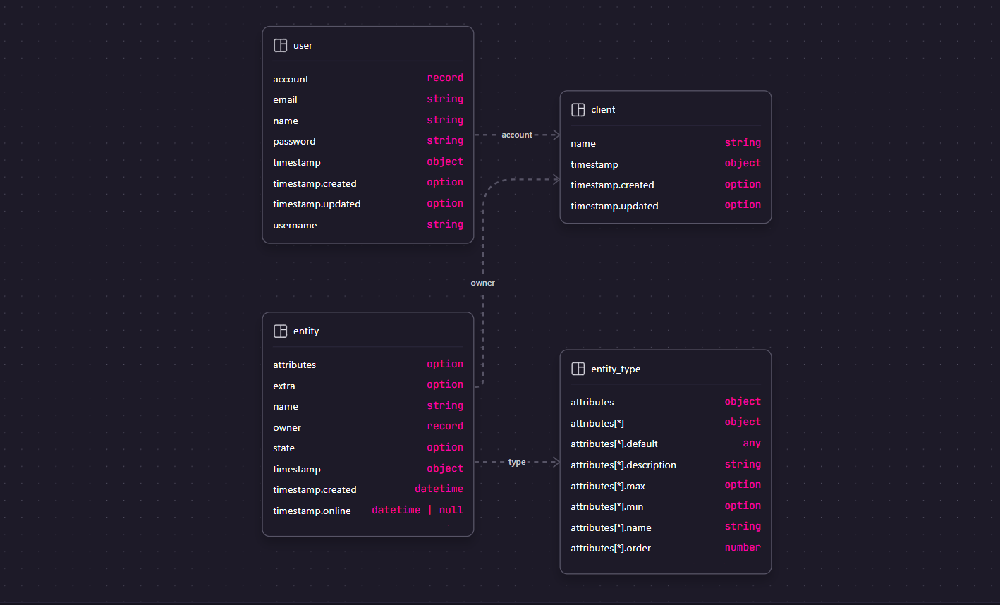

# Future Technical Assessment

- [Getting started](#getting-started)
- [Testing](#testing)
- [Database](#database)
  - [Running local instance (optional)](#running-local-instance-optional)
  - [Inspecting the database](#inspecting-the-database)
  - [Setting up the database](#setting-up-the-database)
- [Environment variables](#environment-variables)

## Getting started

- Clone the repository
- Create a `.env` file by copying `.env.example`
- Install dependencies with `bun install`
- Run the development server with `bun run dev`
- Open http://localhost:3000/swagger with your browser to see the result.

## Testing

- Run the tests with `bun run test`

## Database

The database is a [SurrealDB](https://surrealdb.com/) instance running in memory.

If you want to connect to a remote database, you can use the `DATABASE_URL` environment variable to set the connection string.

For example, to connect to a remote database running on `localhost` with the default port `8000`:

```bash
DATABASE_URL=ws://localhost:8000
```

You can also use the `DATABASE_URL` environment variable to connect to a remote database running on a different host or port:

```bash
DATABASE_URL=ws://remotehost:8000
```

### Running local instance (optional)

You can run a local instance of surreal db by running the following command:

```bash
surreal start  -A --user root --pass root 
```

> Note: You need to have surrealdb installed and in your path. You can download it from [surrealdb.com](https://surrealdb.com/install).

Which is as simple as running:
- On Linux/MacOS:
    ```bash
    curl -sSf https://install.surrealdb.com | sh
    ```
    
- On Windows:
    ```powershell
    iwr https://windows.surrealdb.com -useb | iex
    ```

    Or

    ```powershell
    choco install surreal
    ```

    Or

    ```powershell
    scoop install surrealdb
    ```

- On MacOS:

    ```bash
    brew install surrealdb/tap/surreal
    ```

- On Docker:

    ```bash
    docker run --rm --pull always -p 8000:8000 surrealdb/surrealdb:latest start
    ```

This will start a local instance of surreal db on port `8000`.

> Alternatively, you can create an account on SurrealDB Cloud and use the `DATABASE_*` environment variables to connect to the database.

### Inspecting the database

You can install Surrealist from the surrealdb website or use it from the browser.

[Surrealist](https://surrealdb.com/surrealist)

### Setting up the database

To set up the database, you can use the `bun cli db migrate` command.

This will migrate the database to the latest version.

To seed the database, you can use the `bun cli db seed` command.

This will seed the database with some initial data.

### Database Schema

The database schema is defined in the `src/database/models` folder.

And is as follows:



## Environment variables

The following environment variables can be used to configure the application:

- `NODE_ENV`: The environment mode.
- `HTTP_HOST`: The host to bind the HTTP server to.
- `HTTP_PORT`: The port to bind the HTTP server to.
- `DATABASE_URL`: The connection string to the database.
- `DATABASE_NAMESPACE`: The namespace to use for the database.
- `DATABASE_NAME`: The name of the database.
- `DATABASE_USER`: The user to connect to the database.
- `DATABASE_PASS`: The password to connect to the database.
